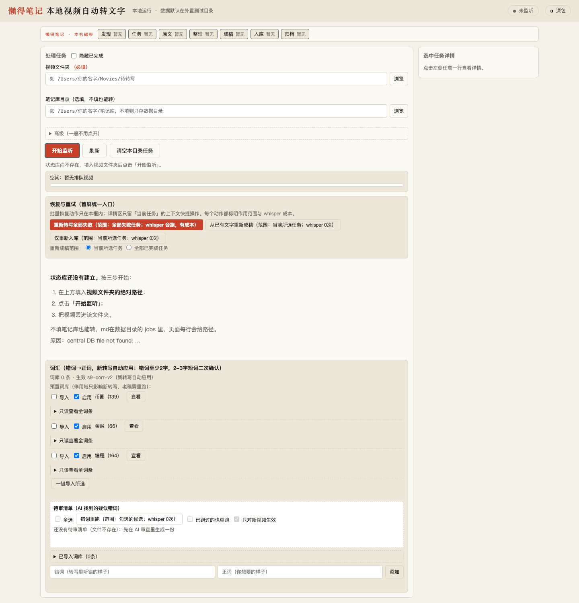

# 懒得笔记｜本地视频自动转写入库工具

> 把本地视频文件夹变成 Obsidian 笔记：丢进视频，自动转写成文字并存为 Markdown。

简体中文 | [English](./README.en.md)



## 这是什么

懒得笔记（Video2Obsidian）是一个在本机运行的小工具。它监听你指定的视频文件夹，把新增视频转写成文字，经过错词修正和分段整理后，保存为 Markdown 笔记。

笔记可以写入你的 Obsidian 库（按原视频的目录结构存放），也可以只生成在数据目录里，不写入任何现有库。源视频会另外归档保存。整个过程不需要调用云 API，不产生 API 费用。

## 核心功能

- **监听文件夹，自动处理**：填好视频文件夹并点开始监听，把视频丢进去即可，后台排队逐个处理，不用守在页面前。
- **本机转写**：用本机 Python 环境里的 `mlx-whisper` 把声音转成文字，中间用 `ffmpeg` 提取音频。
- **错词修正**：在控制台词汇区维护“错词→正词”（比如人名、术语），新转写自动应用，也能一键重跑已有结果。
- **成稿与入库**：转写结果会整理成分段正文并生成 Markdown；填了笔记库目录就按目录镜像写入，不填就只保留在数据目录。
- **任务可见可重试**：任务列表显示发现→听写→整理→成稿→入库的进度，失败的任务可以单独重试，也能预览正文、一键在访达或 Obsidian 里打开。

## 适合谁

- 用 Obsidian 记笔记，同时有课程录像、会议录像、采访素材需要转文字的人。
- 希望数据留在本机、不想把视频上传到云服务的人。
- 运行环境是 Apple Silicon Mac，并能准备好 Python 转写环境的人。

## 快速开始

在仓库根目录执行：

```bash
./app/start.sh
```

启动后浏览器会自动打开：

```text
http://127.0.0.1:8899/
```

页面里按顺序做三件事：

1. 填**视频文件夹**（必填，本机绝对路径）。
2. 填**笔记库目录**（选填；不填也能转，只是不写入 Obsidian）。
3. 点**开始监听**，然后把视频文件放进视频文件夹。

完成后在任务列表点对应行查看正文。

## 安装

### 前置要求

- Apple Silicon Mac。
- Python 3.12，且该 Python 能 `import mlx_whisper`。
- 本机装有 `ffmpeg`（转写前提取音频用）。
- Obsidian 库目录是选填的；不写也能跑通全流程。

后端控制台本身只用 Python 标准库，不需要额外 `pip install`。转写能力依赖你本机已配好的虚拟环境。

### 启动方式

`start.sh` 会按顺序找本机 Python：

```text
stage0bench/bin/python → .venv/bin/python → venv/bin/python → python3
```

- 找到带 `mlx_whisper` 的 Python：转写可用。
- 找不到：控制台照常打开，但点开始转写时会报 `400 PRECHECK_MLX_MISSING`，换对 Python 后重起即可。

端口默认 `127.0.0.1:8899`，只监听本机；如需换端口，用环境变量 `V2O_PORT` 覆盖（`app/start.sh` 会透传给 `app/server.py`）。

## 使用方法

### 最小路径

```bash
./app/start.sh
# 打开 http://127.0.0.1:8899/
# 填视频文件夹 → 点开始监听 → 丢视频进去 → 任务列表看结果
```

支持的输入格式（按控制台实际接收的后缀）：`.mp4` `.mov` `.mkv` `.m4a` `.mp3` `.wav`。

### 词汇修正

在**词汇**区加一行“错词→正词”即可对新转写生效。存量笔记想统一改，用重跑功能重新应用一次。

详细操作见 [使用说明](./docs/usage.md)。

## 配置

| 页面上的项 | 必填 | 说明 |
| --- | --- | --- |
| 视频文件夹 | 是 | 要监听的本机绝对路径，粘贴带引号的路径会自动去引号。 |
| 笔记库目录 | 否 | 为空时只生成到数据目录，不写入 Obsidian。 |
| 数据目录 | 否 | 高级选项；默认放在系统临时目录下（如 `/tmp/v2o-console-data`），不污染你的真实库。 |

完整字段与行为见 [使用说明](./docs/usage.md)，出问题先看 [故障排查](./docs/troubleshooting.md)。

## 技术栈

- **后端**：Python 3.12。控制台本体只用标准库（`http.server` / `json` / `threading` / `urllib` / `sqlite3` 等），无需额外 `pip install`。
- **前端**：单个 `index.html` ＋ 原生 JavaScript（用 localStorage 记住页面偏好），无框架、无构建步骤。
- **转写引擎**：`mlx-whisper`（Apple Silicon 的 MLX 后端，本机推理，不调云 API）。
- **音频提取**：`ffmpeg` 命令行工具。
- **文件监听**：`watchdog`。
- **存储**：SQLite（任务与运行状态，位于数据目录 `data/state.db`）＋ JSON 清单文件。

## 目录结构

```text
.
├── app/          # 本机控制台：server.py（后端）、index.html（前端）、start.sh（启动脚本）、presets/（词库预设）
├── src/          # 转写流水线（stage1–stage12：监听、转写、成稿、入库、归档等）
├── tests/        # 自测脚本
├── docs/         # 使用说明、故障排查、截图，以及 pm/review/qa/handoff 开发记录
├── windows/      # Windows 11 版（开发中，未发布，真机待验；见 windows/README.md）
└── scripts/      # 开发用编排辅助脚本
```

普通使用者只需要看 `app/` 和 `docs/usage.md`、`docs/troubleshooting.md`。

## 详细文档

- [使用说明](./docs/usage.md)
- [故障排查](./docs/troubleshooting.md)

`docs/pm/` `docs/review/` `docs/qa/` `docs/handoff/` 下是本项目的开发计划、评审、测试与交接记录，普通使用不需要看。

## 已知限制

- 目标设备是 Apple Silicon Mac。Windows 11 版在 `windows/` 目录独立开发（**开发中，未发布**，真机待验），见 [windows/README.md](./windows/README.md)。
- 缺 `mlx_whisper` 或 `ffmpeg` 时转写不可用，控制台会明确报错，需要先补好环境。依赖除 `mlx-whisper` 外还需 `watchdog`（本仓库暂无依赖清单文件）。
- 服务重启后监听状态不会自动恢复，需要在页面手动重新开始监听。
- 真实长视频的端到端表现仍在验收中；转写流程保证不断不断流，不保证词级准确率。
- **往监听目录拷入视频后，需等文件写稳（约 7 秒无线索写入）才会被识别入队**；拷贝/下载过程中若长时间停顿（超过约 7 秒）再继续写，可能先按当时内容生成一份**不完整稿**，而完整稿会因 No-Clobber 保护（已存在笔记不覆盖）被挡下。遇到这种不完整稿，请**删除该 md 后重新放入视频**即可正常出稿。
- 本仓库没有 License 文件，默认按“保留所有权利”理解；公开使用或分发前请先补 License。

## License

当前仓库未提供 License 文件。如需开源分发，请先添加并在此处链接。
